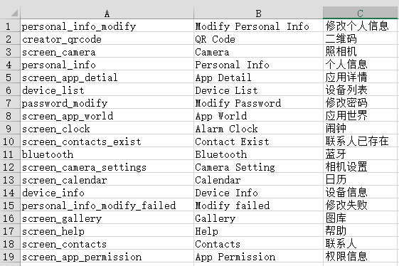
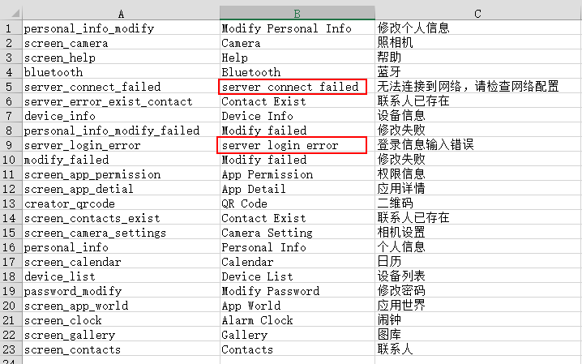

# 本地化助手

## 介绍

假设曾经开发过A项目，也做过本地化，有这样2个本地化文件：

`strings-zh.xml`
```
...
<string name="screen_help">帮助</string>
...
```

`strings-en.xml`
```
...
<string name="screen_help">Help</string>
...
```

现在开发B项目，希望能够自动复用A项目本地化的资源。
如B项目有个本地化文件：`strings.xml`
```
...
<string name="screen_help">帮助</string>
...
```

应用自动本地化后，可以生成新的本地化文件，包含匹配过的结果，如下

```
...
<string name="screen_help">Help</string>
...
```

## 使用

在Test目录下，有2个本地化文件，代表A项目已有的本地化文件，分别是：

`strings-zh.xml`

```
<?xml version="1.0" encoding="utf-8"?>
<resources>

    <string name="device_list">设备列表</string>
    <string name="bluetooth">蓝牙</string>
    <string name="password_modify">修改密码</string>
    <string name="screen_camera">照相机</string>
    <string name="screen_camera_settings">相机设置</string>
    <string name="screen_clock">闹钟</string>
    <string name="screen_gallery">图库</string>
    <string name="screen_contacts">联系人</string>
    <string name="screen_contacts_exist">联系人已存在</string>
    <string name="screen_app_detial">应用详情</string>
    <string name="screen_app_permission">权限信息</string>
    <string name="device_info">设备信息</string>
    <string name="screen_calendar">日历</string>
    <string name="screen_app_world">应用世界</string>
    <string name="screen_help">帮助</string>
    <string name="personal_info">个人信息</string>
    <string name="personal_info_modify">修改个人信息</string>
    <string name="personal_info_modify_failed">修改失败</string>
    <string name="creator_qrcode">二维码</string>
</resources>
```

和`strings-en.xml`

```
<?xml version="1.0" encoding="utf-8"?>
<resources>

    <string name="device_list">Device List</string>
    <string name="bluetooth">Bluetooth</string>
    <string name="password_modify">Modify Password</string>
    <string name="screen_camera">Camera</string>
    <string name="screen_camera_settings">Camera Setting</string>
    <string name="screen_clock">Alarm Clock</string>
    <string name="screen_gallery">Gallery</string>
    <string name="screen_contacts">Contacts</string> 
    <string name="screen_contacts_exist">Contact Exist</string>
    <string name="screen_app_detial">App Detail</string>
    <string name="screen_app_permission">App Permission</string>
    <string name="device_info">Device Info</string>
    <string name="screen_calendar">Calendar</string>
    <string name="screen_app_world">App World</string>
    <string name="screen_help">Help</string>
    <string name="personal_info">Personal Info</string>
    <string name="personal_info_modify">Modify Personal Info</string>
     <string name="personal_info_modify_failed">Modify failed</string>
    <string name="creator_qrcode">QR Code</string>
</resources>
```

现在要处理的文件是`strings.xml`，内容如下：

```
<?xml version="1.0" encoding="utf-8"?>
<resources>

    <string name="device_list">设备列表</string>
    <string name="bluetooth">蓝牙</string>
    <string name="device_list">设备列表</string>
    <string name="bluetooth">蓝牙</string>
    <string name="password_modify">修改密码</string>
    <string name="screen_clock">闹钟</string>
    <string name="screen_gallery">图库</string>
    <string name="screen_contacts">联系人</string>
    <string name="screen_app_detial">应用详情</string>
    <string name="personal_info">个人信息</string>
    <string name="personal_info_modify">修改个人信息</string>
    <string name="creator_qrcode">二维码</string>
    
    <!-- Server Error Text -->
    <string name="server_connect_failed">无法连接到网络，请检查网络配置</string>
    <string name="server_login_error">登录信息输入错误</string>
    <string name="server_error_exist_contact">联系人已存在</string>
    <string name="modify_failed">修改失败</string>
</resources>
```

命令行下运行如下命令：

```
D:\Python\LocalizationHelper\Test> python ..\res_manager.py --dir . --csv map.csv --apply strings.xml
```

它的含义是读取当前目录下全部xml文件，保存其匹配关系到`map.csv`文件，并对`strings.xml`应用。
最终结果是生成TAB作为分隔符的`map.csv`文件和本地化后的`strings.xml.new`文件。

使用Excel打开`map.csv`文件的内容如下：



本地化后的`strings.xml.new`文件内容如下：

```
<?xml version="1.0" encoding="utf-8"?>
<resources>

    <string name="device_list">Device List</string>
    <string name="bluetooth">Bluetooth</string>
    <string name="device_list">Device List</string>
    <string name="bluetooth">Bluetooth</string>
    <string name="password_modify">Modify Password</string>
    <string name="screen_clock">Alarm Clock</string>
    <string name="screen_gallery">Gallery</string>
    <string name="screen_contacts">Contacts</string>
    <string name="screen_app_detial">App Detail</string>
    <string name="personal_info">Personal Info</string>
    <string name="personal_info_modify">Modify Personal Info</string>
    <string name="creator_qrcode">QR Code</string>
    
    <!-- Server Error Text -->
    <string name="server_connect_failed">无法连接到网络，请检查网络配置</string>
    <string name="server_login_error">登录信息输入错误</string>
    <string name="server_error_exist_contact">Contact Exist</string>
    <string name="modify_failed">Modify failed</string>
</resources>
```

可见能处理的都处理了，但是剩余两条因为项目A中没有对应信息，所以残留。

如果希望这两条记录也能自动处理，需要在命令行中加入`--supplement`参数。
这个参数的目的是将`server_login_error`转为`server login error`这样的内容。

命令行下运行如下命令：

```
D:\Python\LocalizationHelper\Test> python ..\res_manager.py --dir . --csv map.csv --apply strings.xml --supplement
```

这次生成的`map.csv`文件的内容如下，红色框中就是自动生成的：



本地化后的`strings.xml.new`文件内容如下：

```
<?xml version="1.0" encoding="utf-8"?>
<resources>

    <string name="device_list">Device List</string>
    <string name="bluetooth">Bluetooth</string>
    <string name="device_list">Device List</string>
    <string name="bluetooth">Bluetooth</string>
    <string name="password_modify">Modify Password</string>
    <string name="screen_clock">Alarm Clock</string>
    <string name="screen_gallery">Gallery</string>
    <string name="screen_contacts">Contacts</string>
    <string name="screen_app_detial">App Detail</string>
    <string name="personal_info">Personal Info</string>
    <string name="personal_info_modify">Modify Personal Info</string>
    <string name="creator_qrcode">QR Code</string>
    
    <!-- Server Error Text -->
    <string name="server_connect_failed">server connect failed</string>
    <string name="server_login_error">server login error</string>
    <string name="server_error_exist_contact">Contact Exist</string>
    <string name="modify_failed">Modify failed</string>
</resources>
```

如果资源ID命名规范，那么使用`--supplement`参数倒是方便，否则还是手动修改吧。

使用中生成的csv文件也可以作为前期资源导入，只需要`--load map.csv`参数。